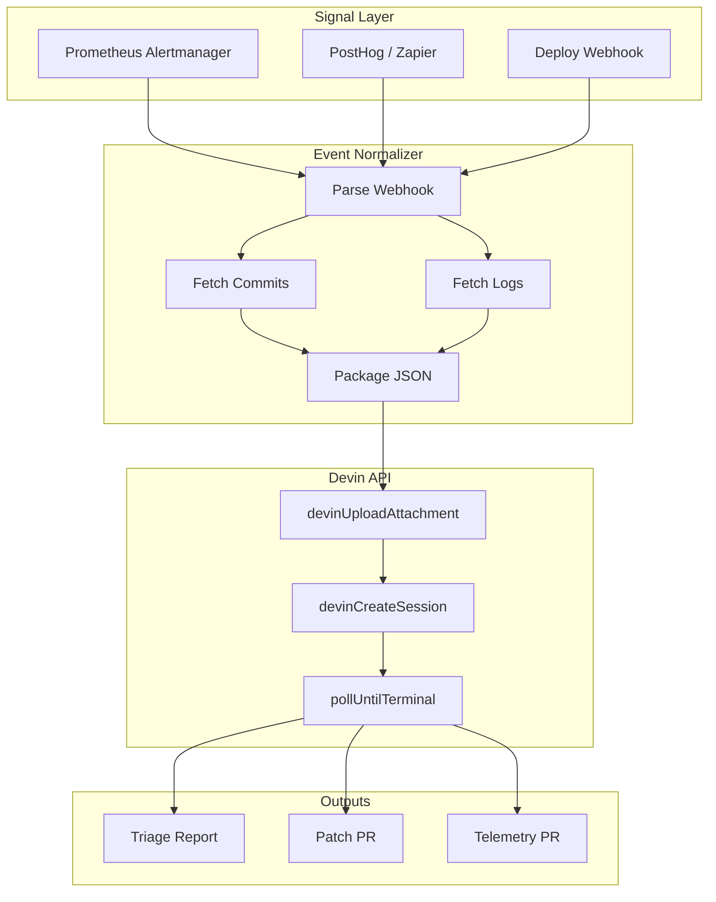

# Build Plan (Original)

Reference build plan—detailed structure, file layout, and phases. See [PRD.md](PRD.md) for product requirements and fixture strategy.

---

## Project Structure

```
incident-triage/
├── package.json              # @devinnn/incident-triage, bin: incident-triage
├── tsconfig.json
├── src/
│   ├── index.ts               # Public API (runTriage, runValidate, etc.)
│   ├── cli.ts                 # CLI entry (validate, run, status, webhook-server)
│   ├── config/
│   │   ├── schema.ts          # incident-triage.yaml Zod schema
│   │   ├── load.ts
│   │   └── validate.ts
│   ├── signals/
│   │   ├── types.ts           # NormalizedSignal, TriggerKind
│   │   ├── prometheus.ts      # Parse Alertmanager webhook payload
│   │   ├── posthog.ts         # Parse PostHog funnel regression (custom webhook)
│   │   ├── deploy.ts          # Failed deploy + error spike (from Vercel/GHA)
│   │   └── normalize.ts      # Unified IncidentPayload type
│   ├── normalizer/
│   │   ├── index.ts           # Event normalizer orchestration
│   │   ├── commits.ts         # Fetch recent commits (git/GitHub API)
│   │   ├── logs.ts            # Fetch logs (provider-agnostic interface)
│   │   └── package.ts         # Build structured JSON for Devin
│   ├── devin/
│   │   ├── v1.ts              # Copy/adapt from docdrift (devinCreateSession, pollUntilTerminal)
│   │   ├── schemas.ts         # TriageReportSchema, TelemetryGapSchema
│   │   └── prompts.ts         # buildTriagePlaybookPrompt()
│   ├── outputs/
│   │   ├── triage-report.ts   # Write/parse markdown triage report
│   │   ├── github.ts          # Create PRs (patch, telemetry improvements)
│   │   └── slack-jira.ts      # Post summary (optional, webhook-based)
│   └── github/
│       └── client.ts          # Octokit (same as docdrift)
├── fixtures/
│   ├── signals/               # POC: Prometheus, deploy, PostHog fixtures
│   └── logs/                  # POC: Incident log fixtures
├── .github/
│   └── workflows/
│       ├── incident-triage.yml
│       └── webhook-receiver.yml
├── incident-triage.schema.json
└── incident-triage.yaml.example
```

---

## Data Flow



---

## Key Files to Reuse from docdrift

| From docdrift | Use in incident-triage |
|---------------|------------------------|
| `src/devin/v1.ts` | Copy; minimal changes (same API) |
| `src/github/client.ts` | Create PR, post comments |
| `src/utils/git.ts` | gitCommitList, gitDiffSummary |
| `src/evidence/bundle.ts` | Pattern for evidence tarball |
| `src/config/load.ts` | Config loading pattern |
| `.github/workflows/devin-doc-drift.yml` | Workflow structure |
